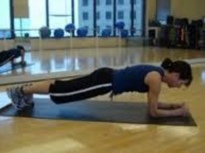
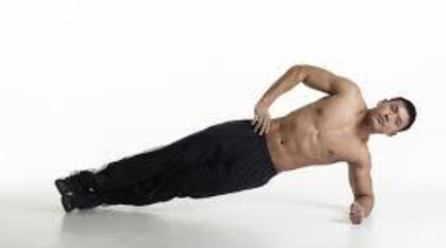

# strengthening

## note: each exercise should be repeated 3 x

1. Plank

60 seconds x 3



2. Side plank

30-60 seconds x 3 each side



3. SINGLE LEG BRIDGE

```
Contract abdominals and gluts as raise buttock off bed. 
Inhale.
Exhale and slowly extend one leg.
Hold for 10 seconds
Inhale and lower leg
Repeat on opposite leg
Repeat 10 – 20 x on each leg
```


